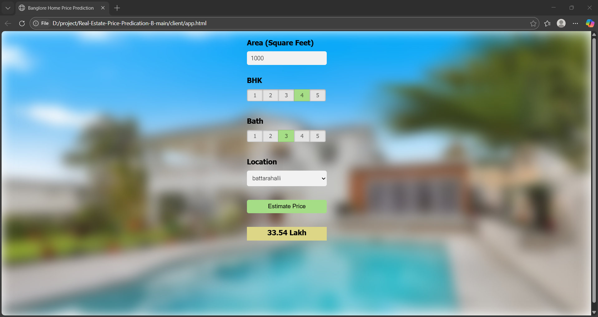

# 🏠 Bangalore House Price Prediction -- Data Science Regression Project

## 📌 Project Overview

This project predicts **house prices in Bangalore** using Machine
Learning (Regression). It covers the **complete end-to-end Data Science
lifecycle**: - Data cleaning - Feature engineering - Outlier removal -
Model training & evaluation - Model deployment using Flask

Dataset source: Kaggle -- Bengaluru House Price Data

------------------------------------------------------------------------

## 📊 Dataset Information

-   Rows: 13,320
-   Target variable: `price` (in lakhs)
-   Key features:
    -   `location`
    -   `total_sqft`
    -   `bath`
    -   `bhk`

------------------------------------------------------------------------

## 🧹 Data Cleaning & Feature Engineering

### Dropped Columns

-   area_type
-   availability
-   society
-   balcony

### New Features

-   `bhk`: extracted from `size`
-   `price_per_sqft`: price normalization

### Handling total_sqft

-   Converted ranges (e.g. 2100--2850 → average)
-   Removed invalid values

------------------------------------------------------------------------

## 📉 Outlier Removal

Business & statistical rules: - Minimum 300 sqft per BHK - Bathroom
count ≤ BHK + 1 - Location-wise price per sqft (mean ± std) - Removed
cases where higher BHK is cheaper than lower BHK in same location

------------------------------------------------------------------------

## 📍 Location Encoding

-   One-Hot Encoding used for locations
-   Locations with ≤10 entries grouped as `other`
-   Final features after encoding: 243

------------------------------------------------------------------------

## 🤖 Model Training

Algorithms tested: - Linear Regression ✅ (Best) - Lasso Regression -
Decision Tree

### Final Model

-   **Linear Regression**
-   Accuracy (R²): \~0.85
-   Cross-validation score: 0.82 -- 0.86

------------------------------------------------------------------------

## 🔮 Prediction Logic

Location is connected to price using **One-Hot Encoding**. Each location
has its own learned weight, directly influencing price.

------------------------------------------------------------------------

## 🌐 Deployment

-   Model saved as: `banglore_home_prices_model.pickle`
-   Columns saved as: `columns.json`
-   Flask backend (`server.py`)
-   Utility functions (`util.py`)
-   REST APIs:
    -   `/get_location_names`
    -   `/predict_home_price`

------------------------------------------------------------------------

## 🛠️ Tech Stack

-   Python
-   Pandas, NumPy
-   Matplotlib
-   Scikit-learn
-   Flask
-   HTML/CSS/JavaScript (Frontend)

------------------------------------------------------------------------

## 🚀 How to Run

``` bash
pip install -r requirements.txt
python server.py
open the app.html
```

------------------------------------------------------------------------
## 📊 Final Output

-----------------------------------------------------------------------
## 🎯 Key Learnings

-   Real-world data cleaning techniques
-   Business-driven outlier removal
-   Feature engineering for regression
-   Model evaluation using cross-validation
-   ML model deployment with Flask

------------------------------------------------------------------------

## 👨‍💻 Author

**Abhiraj Singh Chouhan**\
B.Tech CSE (Data Science)

------------------------------------------------------------------------

## 📎 Dataset Link

https://www.kaggle.com/amitabhajoy/bengaluru-house-price-data
